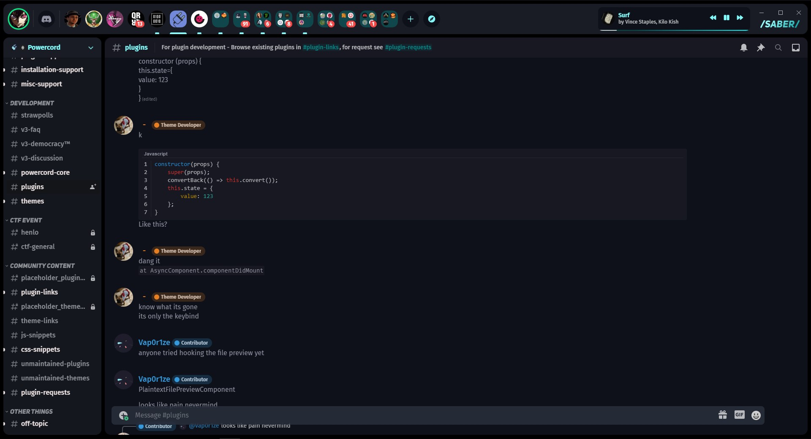

# Probably still full of bugs and bad code

## Installation

### Install Requirements: 
The Slook-Theme: https://github.com/leeprky/slook_theme  
Revamped Userarea: https://github.com/Discord-Theme-Addons/revamped-userarea  
Horizontal Serverlist: https://github.com/DiscordStyles/HorizontalServerList  

### Install SABER:

> Head to C:\Users\<USER>\powercord\src\Powercord

> Right Click "themes" and click Git Bash Here

> Type "git clone https://github.com/leeprky/slook-theme"

> Refresh Discord (CTRL + R)

### Recommended Additions: 
https://github.com/NYRI4/Discolored 
https://github.com/Discord-Theme-Addons/gradientbuttons-v2 
https://github.com/snappercord/Settings-Icons 

## License

MIT, see LICENSE.md for more details
    
## Previews

